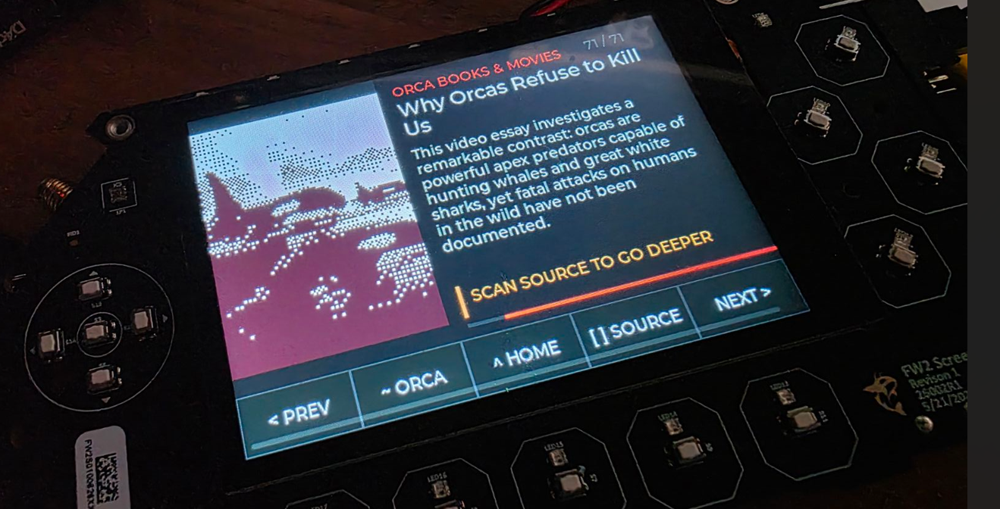

# Orca Field Notes for Free Wili 2

An educational LVGL app for the [Free Wili 2](https://freewili.com/) handheld. It presents a curated archive of orca facts, famous orcas, books, films, and pop-culture stories on the device's 480×320 display.



## Features

- 72 sourced orca stories organized into four sections, including a whale-research donation QR
- Runtime-generated QR codes for sources and videos
- Real ocean and Southern Alaskan orca recordings
- Compact grayscale/red artwork decoded into PSRAM
- Touch-friendly section lists and topic navigation
- Speaker low-power mode when playback is stopped
- Public-domain and openly licensed educational material

## Requirements

- Free Wili 2 hardware
- The [Free Wili BSP](https://github.com/evaderkrub/wilibsp)
- Raspberry Pi Pico SDK and the toolchain required by the BSP
- CMSIS-DAP connection to the display-side RP2350B

## Prebuilt firmware

Download [orca-field-notes-freewili2.uf2](https://github.com/evaderkrub/freewili2-orca-field-notes/releases/latest/download/orca-field-notes-freewili2.uf2) for a ready-to-flash build. It targets the display-side RP2350B in Free Wili 2.

## Install into the BSP

Clone both repositories next to each other, then copy the app into the BSP and apply the integration patch:

```powershell
git clone https://github.com/evaderkrub/wilibsp.git
git clone https://github.com/evaderkrub/freewili2-orca-field-notes.git

Copy-Item -Recurse -Force freewili2-orca-field-notes\apps\orca_browser wilibsp\apps\
Set-Location wilibsp
git apply ..\freewili2-orca-field-notes\patches\wilibsp-integration.patch
```

The patch adds long-form DMA audio streaming, speaker low-power control, and selects CMSIS-DAP interface 0 for the display RP2350.

## Build and flash

From the `wilibsp` directory:

```powershell
python tools/fw.py build orca_browser
python tools/fw.py flash orca_browser
```

## Controls

- Choose a section on the home screen.
- Use Previous and Next to page through story titles.
- Open a title to read its topic page.
- Source displays a QR code for learning more on a phone.
- Sound cycles through orca calls, silence, and ocean audio.
- The Free Wili logo opens a QR code for `freewili.com`.

## Project layout

```text
apps/orca_browser/               LVGL application and embedded assets
patches/wilibsp-integration.patch BSP audio and OpenOCD integration
docs/appscreenshot.png           Hardware screenshot
GitHub Releases                  Ready-to-flash UF2 firmware
AGENTS.md                         Guidance for coding agents
```

## Audio and content credits

- Orca calls: National Park Service hydrophone recording from Glacier Bay, public domain, distributed through [Wikimedia Commons](https://commons.wikimedia.org/wiki/File:Killer_whale.ogg).
- Ocean recording: public-domain recording distributed through [Wikimedia Commons](https://commons.wikimedia.org/wiki/File:Waves.ogg).
- Individual story sources and video links are embedded with each story and exposed as QR codes in the app.

## License

Code and original project materials are released under the [MIT License](LICENSE). Third-party factual sources, linked media, trademarks, and recordings remain subject to their respective terms. Free Wili and its logo are trademarks of their respective owner.
